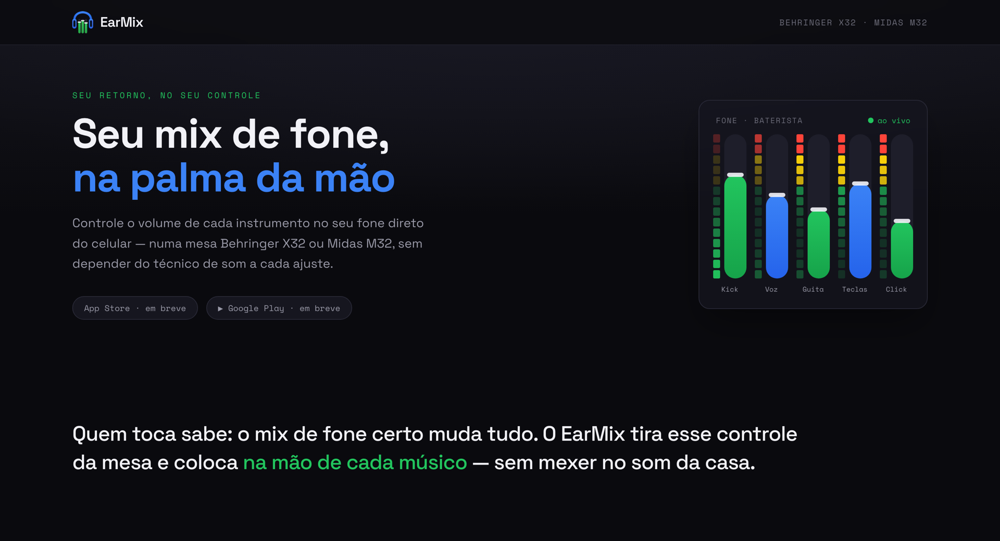

# EarMix — site



Site institucional do **EarMix**, o app que coloca o mix de retorno (fone/in-ear) de uma
mesa **Behringer X32 / Midas M32** na palma da mão do músico. Este repositório é só a
vitrine na web: landing, **Política de Privacidade** e **Termos de Uso** (exigidos pelas
lojas). O aplicativo em si vive em outro repositório.

🔗 **Produção:** [earmix.com.br](https://earmix.com.br)

## Stack

- **Next.js 16** (App Router) + **React 19**
- **Tailwind CSS v4** — configuração _CSS-first_ via `@theme` em `app/globals.css` (sem `tailwind.config.js`)
- **TypeScript**
- Fontes **Space Grotesk** (display) e **Space Mono** (mono/dados) via `next/font`
- Imagem de compartilhamento gerada em tempo de build com **`next/og`**
- Deploy na **Vercel**

## Estrutura

```
app/
├─ layout.tsx            # <html>, fontes, SEO (metadata + OpenGraph/Twitter), theme-color
├─ page.tsx              # Landing (hero, destaques, como funciona)
├─ globals.css           # Tema (@theme): paleta de palco, VU animado, prose das páginas legais
├─ privacidade/page.tsx  # Política de Privacidade
├─ termos/page.tsx       # Termos de Uso
├─ components/
│  ├─ StageMixer.tsx     # Hero "mesa viva" — VU de LED + faders, animação em CSS puro
│  ├─ LegalLayout.tsx    # Layout compartilhado das páginas legais
│  └─ SiteFooter.tsx     # Rodapé
├─ icon.png / apple-icon.png   # Favicon e ícone iOS
├─ opengraph-image.tsx   # Card de compartilhamento 1200×630 (reusado em twitter-image)
├─ sitemap.ts · robots.ts · manifest.ts
```

## Rodando localmente

Requer **Node 18.18+** (recomendado 20+).

```bash
npm install
npm run dev
```

Abra [http://localhost:3000](http://localhost:3000).

## Scripts

| Script          | O que faz                                  |
| --------------- | ------------------------------------------ |
| `npm run dev`   | Servidor de desenvolvimento (hot reload)   |
| `npm run build` | Build de produção                          |
| `npm run start` | Serve o build de produção localmente       |
| `npm run lint`  | ESLint                                     |

## Identidade visual

Tema escuro de palco, herdando as cores da mesa/app:

| Papel         | Cor       |
| ------------- | --------- |
| Fundo         | `#0a0a0e` |
| Fader (verde) | `#22c55e` |
| Fone (azul)   | `#3b82f6` |
| VU — alerta   | `#ffd60a` |
| VU — pico     | `#ff453a` |

Os tokens ficam em `app/globals.css` (bloco `@theme`). A animação de VU respeita
`prefers-reduced-motion`.

## Deploy

Hospedado na **Vercel** com deploy automático a cada push na branch `main` — não use
`output: 'export'` (o site roda no Next nativo, com otimização de imagem e as rotas de
metadata geradas: `/sitemap.xml`, `/robots.txt`, `/opengraph-image`, `/manifest.webmanifest`).

O domínio `earmix.com.br` é configurado em **Settings → Domains** no projeto da Vercel.
